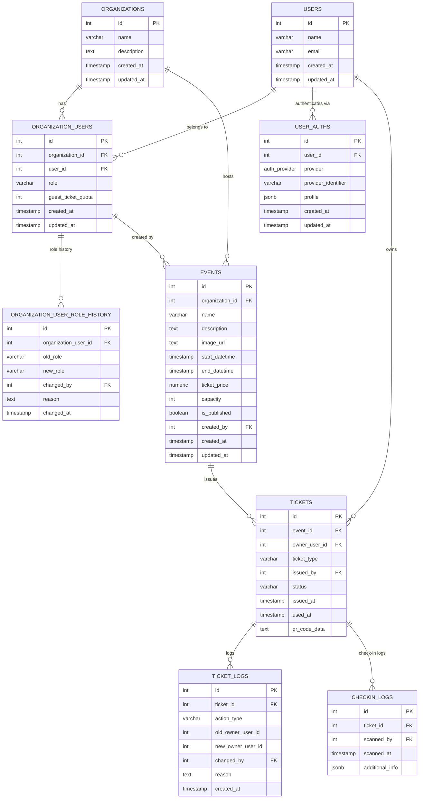

### 説明

- **Organizations テーブル**  
  - 各団体（テナント）の情報を管理します。  
  - 主に団体名や説明、作成日時などを保持。

- **Users テーブル**  
  - グローバルなユーザー情報を管理します。  
  - ユーザー名、メールアドレスなどの基本情報を保存。

- **Organization_Users テーブル**  
  - ユーザーと団体の多対多の関係を管理し、団体ごとの役割（例：admin、operator、user）やゲストチケット発行上限などを保持。  
  - 同一ユーザーが複数の団体に所属でき、団体ごとに役割が異なる場合に対応。

- **Organization_User_Role_History テーブル**  
  - 団体内でのユーザーの役割変更履歴を記録。  
  - 変更前の役割、変更後の役割、変更を行ったユーザー（管理者）や理由、変更日時を保存。

- **User_Auths テーブル**  
  - Google と LINE の認証に特化したテーブル。  
  - プロバイダーは ENUM 型（auth_provider）で制限し、各プロバイダー固有のユニークIDやプロフィール情報（JSONB）を管理。

- **Events テーブル**  
  - 各団体が開催するイベントの情報を管理。  
  - イベント名、説明、画像URL、開始・終了日時、チケット価格、定員、公開状態、作成者（organization_users経由）などの情報を保持。  
  - イベントの更新は最新の状態のみを保存。

- **Tickets テーブル**  
  - イベントごとに発行されるチケット情報を管理。  
  - チケットは購入（purchased）か運営が発行するゲスト（guest）の区別が可能。  
  - また、所有者（ユーザー）、発行者（organization_users）、状態（active、used、cancelled）、発行日時、使用日時、QRコード情報などを含む。

- **Ticket_Logs テーブル**  
  - チケットに対するキャンセル、譲渡、使用などの操作履歴を記録。  
  - 譲渡の場合は、旧所有者、新所有者、操作実行者、理由、操作日時などを保存。

- **Checkin_Logs テーブル**  
  - 管理者がQRコードでチケットをスキャンした際のチェックインログを記録。  
  - スキャンしたチケット、スキャン担当者（organization_users）、スキャン日時、追加情報（JSONB）などを保持。